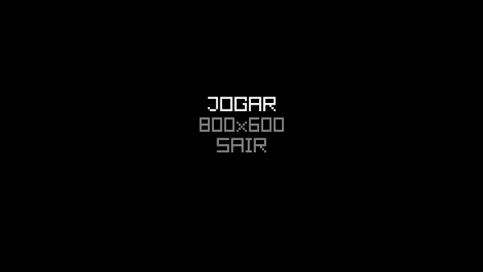

# snake

Simple snake game made with the C programming language and the [raylib](https://github.com/raysan5/raylib) library

## Features

- A main menu where you can change your resolution
- Being able to pause the game
- Game over screen
- Score and highscore system (although the highscore is not saved on disk yet)

## Images

## Compiling from source

### Linux

Install [raylib](https://github.com/raysan5/raylib) either from your package manager or manually

**Arch linux:** `sudo pacman -S raylib`

If you have make installed and raylib is on the include path, all you need to do is cd to the source directory and run `make`

Or you can run gcc manually: 

    gcc -o snake main.c snake.c -I /path/to/raylib/include -L /path/to/raylib/lib -lraylib -lGL -lm -lpthread -ldl -lrt -lX11

### Windows

Get a release of [raylib](https://github.com/raysan5/raylib) for windows, then you can use [MinGW-w64](https://www.mingw-w64.org/) to compile it:

    gcc -o snake.exe main.c snake.c -I path\to\raylib\include -L path\to\raylib\lib -lraylib -lgdi32 -lwinmm
